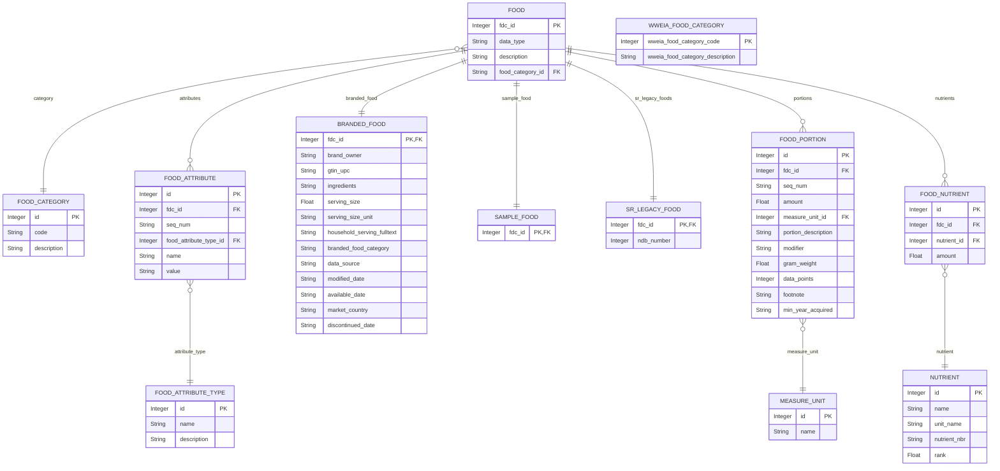

# nutrition-calculator

## Podstawowe założenia projektu:

Aplikacja będzie miała za zadanie przeliczenie wartości odżywczych w wybranej przez użytkownika żywności (podstawowe - węglowodany, białka, tłuszcze, skład ilościowy wody), (inne - np. witaminy, minerały), (kcal) - wyniki będą opracowane na podstawie dostępnych baz/bazy danych powiązanych z żywnością. W przypadku nie odnalezienia podanego typu żywności program nie będzie wyświetlał wyników.

Program będzie przeliczał wartości odżywcze przypadające na wybraną (ustaloną) ilość, np. 100 g.

Projekt będzie oparty na wykorzystaniu podstawowego terminala (bez GUI).

Wykorzystanie SQLite - prostota projektu oraz wykorzystanie lokalnej bazy danych.

Link do przykładowej bazy danych:

https://github.com/MenuLogistics/USDASQLite

### Propozycje zmian/rozszerzenia projektu:

- wprowadzenie GUI
- możliwość korzystania z baz danych online

- możliwość określenia ilości wybranej żywności (w g) na jaką mają być wyliczone wartości odżywcze
- możliwość wyliczenia wartości odżywczych na podstawie dania (nie pojedynczego produktu)

Uproszczony schemat wykorzystywanej bazy danych:

