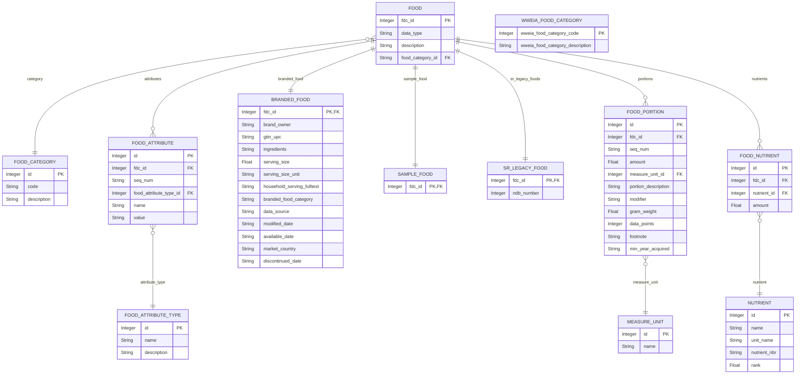

# NutriCalc - nutrition-calculator

## Założenia projektu:

Aplikacja będzie miała za zadanie przeliczenie wartości odżywczych w wybranej przez użytkownika żywności (podstawowe - węglowodany, białka, tłuszcze, skład ilościowy wody), (inne - np. witaminy, minerały - opcjonalnie), (kcal) - wyniki będą opracowane na podstawie dostępnych baz/bazy danych powiązanych z żywnością (baza danych USDA). W przypadku nie odnalezienia podanego typu żywności program nie będzie wyświetlał wyników.

Program będzie przeliczał wartości odżywcze przypadające na wybraną (ustaloną) ilość, np. 100 g.


Projekt będzie oparty na wykorzystaniu terminala (bez GUI).

### Propozycje zmian/rozszerzenia projektu:

- wprowadzenie GUI 
- możliwość korzystania z baz danych online
- korzystanie z innej bazy danych (zawierających polską żywność/produkty)

- możliwość wyliczenia wartości odżywczych na podstawie dania (nie pojedynczego produktu)

## Funkcjonalności

- wyświetlanie podstawowych wyników wyszukiwań dla wybranej żywności ✅
- wyświetlanie podstawowych składników odżywczych dla wybranej żywności (węglowodany, białka, tłuszcze, wartość odżywcza w kcal) ✅

- wyświetlanie wyników dla wybranej przez użytkownika wartości (w g) (domyślnie jest to 100 g) ✅

## Technologie

- SQLite + SQLAlchemy (lokalna baza danych)

### Link do wykorzystywanej bazy danych:

```
https://github.com/MenuLogistics/USDASQLite
```

### Uproszczony schemat wykorzystywanej bazy danych:

